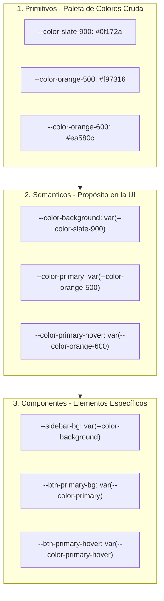
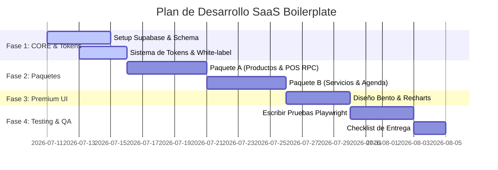

# Análisis y Optimización del Plan: Plantilla Base Multi-Rubro (SaaS Boilerplate)

Este documento presenta una evaluación detallada del plano técnico original detallado en [plan_plantilla_admin.md](file:///C:/Users/TavaTeam/Desktop/plantilla%20react/plan_plantilla_admin.md), enriquecido con metodologías de diseño y desarrollo de nivel premium provenientes de nuestras nuevas skills: **Sistemas de Diseño (tokens jerárquicos)**, **Diseño Frontend Premium (Aesthetic & Typography)**, **UI-UX Pro Max (Bento Grids & Layouts)** y **Webapp Testing (Playwright)**.

---

## 🎨 1. Sistema de Tokens de 3 Capas (White-Labeling Robusto)

El plan original propone variables CSS básicas en `businessConfig.js` (`primary` y `secondary`). Para un SaaS robusto de marca blanca, implementaremos una **arquitectura de tokens de tres capas** (Primitive → Semantic → Component) de acuerdo con los estándares de **design-system**. Esto permite cambiar de tema, de colores y activar el **Modo Oscuro** de forma automática y consistente.

### Propuesta de Estructura de Tokens



### Implementación en `src/config/businessConfig.js`
Expandimos la configuración del negocio para incluir tipografías, densidades y esquemas de color extendidos:

```javascript
export const BUSINESS_CONFIG = {
  nombre: "Despensa El Barrio",
  tipo: "productos", // "productos" | "servicios"
  moneda: "$",
  theme: "dark", // "light" | "dark"
  density: "compact", // "spacious" | "compact" (Modo Dashboard vs Landing)
  branding: {
    // Definición de colores primordiales (se mapean a variables semánticas)
    primary: {
      light: "#f97316", // Naranja
      dark: "#ea580c"
    },
    secondary: {
      light: "#1e293b", // Slate
      dark: "#0f172a"
    },
    // Tipografías curadas según el rubro (Fira Code/Sans para Dashboards, Inter para general)
    fontHeading: "Fira Sans, sans-serif",
    fontBody: "Inter, sans-serif",
  }
};
```

---

## 📐 2. Estructura UI/UX Premium (Bento Grid & Typography)

Un dashboard administrativo moderno no debe parecer una plantilla genérica. De acuerdo con las guías de **frontend-design** y **ui-ux-pro-max**:
1. **Layout Bento Grid**: Organizaremos el Dashboard utilizando tarjetas Bento asimétricas con micro-interacciones suaves en lugar de tarjetas cuadradas simples de estadísticas.
2. **Tipografía Intencional**: Usaremos la combinación **Fira Sans / Fira Code** para rubros con alta densidad de datos (inventarios, punto de venta) para dar una sensación técnica y limpia de precisión.

### Prototipo de Dashboard Bento (ASCII Wireframe)
```
┌────────────────────────────────────────────────────────────────────────┐
│  [Header / Buscador Global / Avatar]                                  │
├──────────────────────────────────────┬─────────────────────────────────┤
│  [Tarjeta Bento 1: Ventas del Día]   │ [Tarjeta Bento 2: Atajos POS]   │
│  - Gráfico de Tendencia Recharts     │ - Botón rápido "Nueva Venta"    │
│  - Total facturado y tasa de cambio  │ - Botón rápido "Nuevo Cliente"  │
├──────────────────────────────────────┴─────────────────────────────────┤
│  [Tarjeta Bento 3: Stock Crítico / Alertas de Agenda]                  │
│  - Tabla compacta con scroll interno                                   │
│  - Alertas visuales con bordes y glows sutiles                         │
└────────────────────────────────────────────────────────────────────────┘
```

---

## ⚙️ 3. Arquitectura de Código Escalable (Routing Declarativo)

En lugar de renderizados condicionales dispersos por todo el código (`BUSINESS_CONFIG.tipo === '...'`), unificamos las vistas en un **enrutador declarativo** en `src/config/routesConfig.js`. Esto facilita agregar nuevos paquetes y auditar rutas.

```javascript
import { LayoutDashboard, Users, Package, ShoppingCart, Calendar, Clock } from 'lucide-react';

export const routesConfig = [
  {
    path: "/dashboard",
    label: "Dashboard",
    icon: LayoutDashboard,
    component: "Dashboard",
    roles: ["admin", "empleado"],
    requiredPackage: "core"
  },
  {
    path: "/clientes",
    label: "Clientes",
    icon: Users,
    component: "Clientes",
    roles: ["admin", "empleado"],
    requiredPackage: "core"
  },
  // Paquete A: Productos
  {
    path: "/inventario",
    label: "Inventario",
    icon: Package,
    component: "Inventario",
    roles: ["admin", "empleado"],
    requiredPackage: "productos"
  },
  {
    path: "/punto-venta",
    label: "Punto de Venta",
    icon: ShoppingCart,
    component: "PuntoVenta",
    roles: ["admin", "empleado"],
    requiredPackage: "productos"
  },
  // Paquete B: Servicios
  {
    path: "/agenda",
    label: "Agenda",
    icon: Calendar,
    component: "Agenda",
    roles: ["admin", "empleado"],
    requiredPackage: "servicios"
  },
  {
    path: "/turnos",
    label: "Turnos",
    icon: Clock,
    component: "Turnos",
    roles: ["admin", "empleado"],
    requiredPackage: "servicios"
  }
];
```

Esto permite generar el menú lateral (`Sidebar.jsx`) y las rutas (`App.jsx`) iterando sobre la configuración filtrada:
```javascript
const routesActivas = routesConfig.filter(route => 
  route.requiredPackage === "core" || route.requiredPackage === BUSINESS_CONFIG.tipo
);
```

---

## 🧪 4. Estrategia de Testing Automatizado (Playwright)

Para asegurar la robustez de la plantilla antes de desplegarla a un cliente nuevo, introducimos una estrategia de **webapp-testing** usando Playwright. Esto previene regresiones en los RLS de Supabase y asegura que la lógica multi-rubro funcione correctamente.

### Pruebas E2E Críticas a Automatizar
1. **Aislamiento de Rubros**: Verificar que si `BUSINESS_CONFIG.tipo === 'servicios'`, las rutas de `/inventario` y `/punto-venta` devuelvan 404 (o redirijan) y que no aparezcan en el Sidebar.
2. **Seguridad (RLS Bypass check)**: Comprobar que peticiones no autenticadas a la API de Supabase o páginas internas sean redirigidas inmediatamente a `/login`.
3. **Flujo de Venta Atómico (POS)**: Probar que al ejecutar la función RPC `registrar_venta` concurrente con stock limitado, el sistema bloquee correctamente y prevenga el stock negativo.
4. **Pruebas de Responsive**: Validar que la interfaz escale correctamente a dispositivos móviles (resolución de 375px de ancho) sin desbordamientos horizontales.

---

## 📈 Plan de Trabajo Optimizado



---

> [!NOTE]
> Al aplicar este enfoque sistemático, la plantilla base no solo es reutilizable, sino que se convierte en un framework de marca blanca de alta fidelidad, fácil de mantener y de actualizar a medida que sumas más rubros en el futuro.
